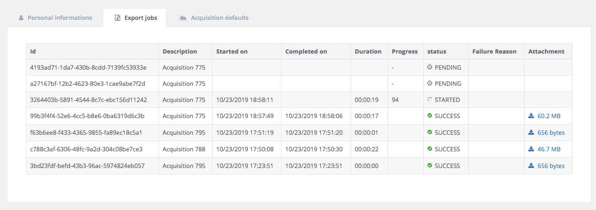

===========
django-task
===========

.. image:: https://badge.fury.io/py/django-task.svg
    :target: https://badge.fury.io/py/django-task

.. image:: https://travis-ci.org/morlandi/django-task.svg?branch=master
    :target: https://travis-ci.org/morlandi/django-task

.. image:: https://codecov.io/gh/morlandi/django-task/branch/master/graph/badge.svg
    :target: https://codecov.io/gh/morlandi/django-task

A Django app to run new background tasks from either admin or cron, and inspect task history from admin

.. contents::

.. sectnum::

Quickstart
----------

1) **Install Django Task**:

.. code-block:: bash

    pip install django-task

2) **Add it to your `INSTALLED_APPS`**:

.. code-block:: python

    INSTALLED_APPS = (
        ...
        'django_rq',  # optional, if using TaskTheaded
        'django_task',
        ...
    )

3) **Add Django Task's URL patterns**:

.. code-block:: python

    urlpatterns = [
        ...
        path('django_task/', include('django_task.urls', namespace='django_task')),
        ...
    ]

4) **Configure Redis and RQ in settings.py** (optional, if using TaskTheaded):

.. code-block:: python

    #REDIS_URL = 'redis://localhost:6379/0'
    redis_host = os.environ.get('REDIS_HOST', 'localhost')
    redis_port = 6379
    REDIS_URL = 'redis://%s:%d/0' % (redis_host, redis_port)

    CACHES = {
        'default': {
            'BACKEND': 'redis_cache.RedisCache',
            'LOCATION': REDIS_URL
        },
    }

    #
    # RQ config
    #

    RQ_PREFIX = "myproject_"
    QUEUE_DEFAULT = RQ_PREFIX + 'default'
    QUEUE_HIGH = RQ_PREFIX + 'high'
    QUEUE_LOW = RQ_PREFIX + 'low'

    RQ_QUEUES = {
        QUEUE_DEFAULT: {
            'URL': REDIS_URL,
            #'PASSWORD': 'some-password',
            'DEFAULT_TIMEOUT': 360,
        },
        QUEUE_HIGH: {
            'URL': REDIS_URL,
            'DEFAULT_TIMEOUT': 500,
        },
        QUEUE_LOW: {
            'URL': REDIS_URL,
            #'ASYNC': False,
        },
    }

Note: if you plan to install many instances of the project on the same server,
for each instance use a specific value for `RQ_PREFIX`; for example:

.. code-block:: python

    INSTANCE_PREFIX = "myproject_"
    try:
        from project.settings.instance_prefix import *
    except Exception as e:
        pass
    RQ_PREFIX = INSTANCE_PREFIX

    QUEUE_DEFAULT = RQ_PREFIX + '_default'
    QUEUE_LOW = RQ_PREFIX + '_low'
    QUEUE_HIGH = RQ_PREFIX + '_high'

    ...

5) **Customize django-task specific settings (optional)**:

.. code-block:: python

    RQ_SHOW_ADMIN_LINK = False
    DJANGOTASK_LOG_ROOT = os.path.abspath(os.path.join(BASE_DIR, '..', 'protected', 'tasklog'))
    DJANGOTASK_ALWAYS_EAGER = False
    DJANGOTASK_JOB_TRACE_ENABLED = False
    DJANGOTASK_REJECT_IF_NO_WORKER_ACTIVE_FOR_QUEUE = True

6) **Optionally, revoke pending tasks at startapp**;

file `main/apps.py`:

.. code-block:: python

    class MainConfig(AppConfig):

        ...

        def ready(self):

            ...
            try:
                from django_task.utils import revoke_pending_tasks
                revoke_pending_tasks()
            except Exception as e:
                print(e)

Features
--------

**Purposes**

- create async tasks either programmatically or from admin
- monitor async tasks from admin
- log all tasks in the database for later inspection
- optionally save task-specific logs in a TextField and/or in a FileField

**Details**

1. each specific job is described my a Model derived from models.Task, which
   is responsible for:

   - selecting the name for the consumer queue among available queues
   - collecting and saving all parameters required by the associated job
   - running the specific job asyncronously

2. a new job can be run either:

   - creating a Task from the Django admin
   - creating a Task from code, then calling Task.run()

3. job execution workflow:

   - job execution is triggered by task.run(is_async)
   - job will receive the task.id, and retrieve paramerts from it
   - on start, job will update task status to 'STARTED' and save job.id for reference
   - during execution, the job can update the progress indicator
   - on completion, task status is finally updated to either 'SUCCESS' or 'FAILURE'
   - See example.jobs.count_beans for an example

Screenshots
-----------

.. image:: example/etc/screenshot_001.png

.. image:: example/etc/screenshot_002.png

App settings
------------

DJANGOTASK_LOG_ROOT
    Path for log files.

    Default: None

    Example: os.path.abspath(os.path.join(BASE_DIR, '..', 'protected', 'tasklog'))

DJANGOTASK_ALWAYS_EAGER
    When True, all task are execute syncronously (useful for debugging and unit testing).

    Default: False

DJANGOTASK_JOB_TRACE_ENABLED
    Enables low level tracing in Job.run() - for debugging challenging race conditions

    Default: False

DJANGOTASK_REJECT_IF_NO_WORKER_ACTIVE_FOR_QUEUE
    Rejects task if not active worker is available for the specific task queue
    when task.run() is called

    Default: False

REDIS_URL
    Redis server to connect to

    Default: 'redis://localhost:6379/0'

Running Tests
-------------

Does the code actually work?

Running the unit tests from your project::

    python manage.py test -v 2 django_task --settings=django_task.tests.settings

Running the unit tests from your local fork::

    source <YOURVIRTUALENV>/bin/activate
    (myenv) $ pip install tox
    (myenv) $ tox

or::

    python ./runtests.py

or::

    coverage run --source='.' runtests.py
    coverage report

Threaded vs RQ-based tasks
--------------------------

The original implementation is based on django-rq and RQ (a Redis based Python queuing library).

On some occasions, using a background queue may be overkill or even inappropriate:
if you need to run many short I/O-bound background tasks concurrently, the serialization
provided by the queue, while limiting the usage of resources, would cause eccessive delay.

Starting from version 2.0.0, in those cases you can use TaskThreaded instead of TaskRQ;
this way, each background task will run in it's own thread.

**MIGRATING FROM django-task 1.5.1 to 2.0.0**

- derive your queue-based tasks from TaskRQ instead of Task
- or use TaskThreaded
- get_jobclass() overridable replaces get_jobfunc()

Support Job class
-----------------

Starting from version 0.3.0, some conveniences have been added:

- The @job decorator for job functions is no more required, as Task.run() now
  uses queue.enqueue() instead of jobfunc.delay(), and retrieves the queue
  name directly from the Task itself

- each Task can set it's own TASK_TIMEOUT value (expressed in seconds),
  that when provided overrides the default queue timeout

- a new Job class has been provided to share suggested common logic before and
  after jobfunc execution; you can either override `run()` to implement a custom logic,
  or (in most cases) just supply your own `execute()` method, and optionally
  override `on_complete()` to execute cleanup actions after job completion;

example:

.. code :: python

    class CountBeansJob(Job):

        @staticmethod
        def execute(job, task):
            num_beans = task.num_beans
            for i in range(0, num_beans):
                time.sleep(0.01)
                task.set_progress((i + 1) * 100 / num_beans, step=10)

        @staticmethod
        def on_complete(job, task):
            print('task "%s" completed with: %s' % (str(task.id), task.status))
            # An more realistic example from a real project ...
            # if task.status != 'SUCCESS' or task.error_counter > 0:
            #    task.alarm = BaseTask.ALARM_STATUS_ALARMED
            #    task.save(update_fields=['alarm', ])

**Execute**

Run consumer:

.. code:: bash

    python manage.py runserver

Run worker(s):

.. code:: bash

    python manage.py rqworker low high default
    python manage.py rqworker low high default
    ...

**Sample Task**

.. code:: python

    from django.db import models
    from django.conf import settings
    from django_task.models import TaskRQ

    class SendEmailTask(TaskRQ):

        sender = models.CharField(max_length=256, null=False, blank=False)
        recipients = models.TextField(null=False, blank=False,
            help_text='put addresses in separate rows')
        subject = models.CharField(max_length=256, null=False, blank=False)
        message = models.TextField(null=False, blank=True)

        TASK_QUEUE = settings.QUEUE_LOW
        TASK_TIMEOUT = 60
        LOG_TO_FIELD = True
        LOG_TO_FILE = False
        DEFAULT_VERBOSITY = 2

        @staticmethod
        def get_jobclass():
            from .jobs import SendEmailJob
            return SendEmailJob

You can change the `verbosity` dynamically by overridding the verbosity property:

.. code:: python

    class SendEmailTask(TaskRQ):

        @property
        def verbosity(self):
            #return self.DEFAULT_VERBOSITY
            return 1  # either 0, 1 or 2

When using **LOG_TO_FILE = True**, you might want to add a cleanup handler to
remove the log file when the corresponding record is deleted::

    import os
    from django.dispatch import receiver

    @receiver(models.signals.post_delete, sender=ImportaCantieriTask)
    def on_sendemailtask_delete_cleanup(sender, instance, **kwargs):
        """
        Autodelete logfile on Task delete
        """
        logfile = instance._logfile()
        if os.path.isfile(logfile):
            os.remove(logfile)

**Sample Job**

.. code:: python

    import redis
    import logging
    import traceback
    from django.conf import settings
    from .models import SendEmailTask
    from django_task.job import Job

    class SendEmailJob(Job):

        @staticmethod
        def execute(job, task):
            recipient_list = task.recipients.split()
            sender = task.sender.strip()
            subject = task.subject.strip()
            message = task.message
            from django.core.mail import send_mail
            send_mail(subject, message, sender, recipient_list)

**Sample management command**

.. code:: python

    from django_task.task_command import TaskCommand
    from django.contrib.auth import get_user_model

    class Command(TaskCommand):

        def add_arguments(self, parser):
            super(Command, self).add_arguments(parser)
            parser.add_argument('sender')
            parser.add_argument('subject')
            parser.add_argument('message')
            parser.add_argument('-r', '--recipients', nargs='*')
            parser.add_argument('-u', '--user', type=str, help="Specify username for 'created_by' task field")

        def handle(self, *args, **options):
            from tasks.models import SendEmailTask

            # transform the list of recipents into text
            # (one line for each recipient)
            options['recipients'] = '\n'.join(options['recipients']) if options['recipients'] is not None else ''

            # format multiline message
            options['message'] = options['message'].replace('\\n', '\n')

            if 'user' in options:
                created_by = get_user_model().objects.get(username=options['user'])
            else:
                created_by = None

            self.run_task(SendEmailTask, created_by=created_by, **options)

**Deferred Task retrieval to avoid job vs. Task race condition**

An helper Task.get_task_from_id() classmethod is supplied to retrieve Task object
from task_id safely.

*Task queues create a new type of race condition. Why ?
Because message queues are fast !
How fast ?
Faster than databases.*

See:

https://speakerdeck.com/siloraptor/django-tasty-salad-dos-and-donts-using-celery

A similar generic helper is available for Job-derived needs::

    django_task.utils.get_model_from_id(model_cls, id, timeout=1000, retry_count=10)

**Howto separate jobs for different instances on the same machine**

To sepatare jobs for different instances on the same machine (or more precisely
for the same redis connection), override queues names for each instance;

for example:

.. code:: python

    # file "settings.py"

    REDIS_URL = 'redis://localhost:6379/0'
    ...

    #
    # RQ config
    #

    RQ_PREFIX = "myproject_"
    QUEUE_DEFAULT = RQ_PREFIX + 'default'
    QUEUE_HIGH = RQ_PREFIX + 'high'
    QUEUE_LOW = RQ_PREFIX + 'low'

    RQ_QUEUES = {
        QUEUE_DEFAULT: {
            'URL': REDIS_URL,
            #'PASSWORD': 'some-password',
            'DEFAULT_TIMEOUT': 360,
        },
        QUEUE_HIGH: {
            'URL': REDIS_URL,
            'DEFAULT_TIMEOUT': 500,
        },
        QUEUE_LOW: {
            'URL': REDIS_URL,
            #'ASYNC': False,
        },
    }

    RQ_SHOW_ADMIN_LINK = False
    DJANGOTASK_LOG_ROOT = os.path.abspath(os.path.join(BASE_DIR, '..', 'protected', 'tasklog'))
    DJANGOTASK_ALWAYS_EAGER = False
    DJANGOTASK_JOB_TRACE_ENABLED = False
    DJANGOTASK_REJECT_IF_NO_WORKER_ACTIVE_FOR_QUEUE = True

then run worker as follows:

.. code:: python

    python manage.py rqworker myproject_default

**Howto schedule jobs with cron**

Call management command 'count_beans', which in turn executes the required job.

For example::

    SHELL=/bin/bash
    PATH=/usr/local/sbin:/usr/local/bin:/sbin:/bin:/usr/sbin:/usr/bin

    0 * * * *  {{username}}    timeout 55m {{django.pythonpath}}/python {{django.website_home}}/manage.py count_beans 1000 >> {{django.logto}}/cron.log 2>&1

A base class TaskCommand has been provided to simplify the creation of any specific
task-related management commad;

a derived management command is only responsible for:

- defining suitable command-line parameters
- selecting the specific Task class and job function

for example:

.. code:: python

    from django_task.task_command import TaskCommand

    class Command(TaskCommand):

        def add_arguments(self, parser):
            super(Command, self).add_arguments(parser)
            parser.add_argument('num_beans', type=int)

        def handle(self, *args, **options):
            from tasks.models import CountBeansTask
            self.run_task(CountBeansTask, **options)

Javascript helpers
------------------

A few utility views have been supplied for interacting with tasks from javascript.

tasks_info_api
..............

Retrieve informations about a list of existing tasks

Sample usage:

.. code:: javascript

    var tasks = [{
        id: 'c50bf040-a886-4aed-bf41-4ae794db0941',
        model: 'tasks.devicetesttask'
    }, {
        id: 'e567c651-c8d5-4dc7-9cbf-860988f55022',
        model: 'tasks.devicetesttask'
    }];

    $.ajax({
        url: '/django_task/info/',
        data: JSON.stringify(tasks),
        cache: false,
        type: 'post',
        dataType: 'json',
        headers: {'X-CSRFToken': getCookie('csrftoken')}
    }).done(function(data) {
        console.log('data: %o', data);
    });

Result::

    [
      {
        "id": "c50bf040-a886-4aed-bf41-4ae794db0941",
        "created_on": "2018-10-11T17:45:14.399491+00:00",
        "created_on_display": "10/11/2018 19:45:14",
        "created_by": "4f943f0b-f5a3-4fd8-bb2e-451d2be107e2",
        "started_on": null,
        "started_on_display": "",
        "completed_on": null,
        "completed_on_display": "",
        "job_id": "",
        "status": "PENDING",
        "status_display": "
PENDING
",
        "log_link_display": "",
        "failure_reason": "",
        "progress": null,
        "progress_display": "-",
        "completed": false,
        "duration": null,
        "duration_display": "",
        "extra_fields": {
        }
      },
      ...
    ]

task_add_api
............

Create and run a new task based on specified parameters

Expected parameters:

- 'task-model' = "<app_name>.<model_name>"
- ... task parameters ...

Returns the id of the new task.

Sample usage:

.. code:: javascript

    function exportAcquisition(object_id) {
        if (confirm('Do you want to export data ?')) {

            var url = '/django_task/add/';
            var data = JSON.stringify({
                'task-model': 'tasks.exportdatatask',
                'source': 'backend.acquisition',
                'object_id': object_id
            });

            $.ajax({
                type: 'POST',
                url: url,
                data: data,
                cache: false,
                crossDomain: true,
                dataType: 'json',
                headers: {'X-CSRFToken': getCookie('csrftoken')}
            }).done(function(data) {
                console.log('data: %o', data);
                alert('New task created: "' + data.task_id + '"');
            }).fail(function(jqXHR, textStatus, errorThrown) {
                console.log('ERROR: ' + jqXHR.responseText);
                alert(errorThrown);
            });
        }
        return;
    }

task_run_api
............

Schedule execution of specified task.

Returns job.id or throws error (400).

Parameters:

- app_label
- model_name
- pk
- is_async (0 or 1, default=1)

Sample usage:

.. code:: javascript

    var task_id = 'c50bf040-a886-4aed-bf41-4ae794db0941';

    $.ajax({
        url: sprintf('/django_task/tasks/devicetesttask/%s/run/', task_id),
        cache: false,
        type: 'get'
    }).done(function(data) {
        console.log('data: %o', data);
    }).fail(function(jqXHR, textStatus, errorThrown) {
        display_server_error(jqXHR.responseText);
    });

Updating the tasks listing dynamically in the frontend
------------------------------------------------------

The list of Tasks in the admin changelist_view is automatically updated to refresh
the progess and status of each running Task.

You can obtain the same result in the frontend by calling the **DjangoTask.update_tasks()**
javascript helper, provided you're listing the tasks in an HTML table with a similar layout.

The simplest way to do it is to use the **render_task_column_names_as_table_row**
and **render_task_as_table_row** template tags.

Example:

.. code:: html

    

    
        


    
        <table id="export_data_tasks" class="table table-striped">
            
            <thead>
                <tr>
                    {{ export_data_tasks.0|render_task_column_names_as_table_row:excluded }}
                </tr>
            </thead>
            <tbody>
                
                <tr>
                    {{ task|render_task_as_table_row:excluded }}
                </tr>
                
            </tbody>
        </table>
        
    

    
        {{ block.super }}
        
        
    

For each fieldname included in the table rows, **render_task_as_table_row** will
check if a FIELDNAME_display() method is available in the Task model, and in case
will use it for rendering the field value; otherwise, the field value will be simply
converted into a string.

If the specific derived Task model defines some additional fields (unknown to the base Task model)
which need to be updated regularly by **DjangoTask.update_tasks()**, include them as "extra_fields"
as follows:

.. code:: python

    def as_dict(self):
        data = super(ExportDataTask, self).as_dict()
        data['extra_fields'] = {
            'result_display': mark_safe(self.result_display())
        }
        return data

Example Project for django-task
-------------------------------

As example project is provided as a convenience feature to allow potential users
to try the app straight from the app repo without having to create a django project.

Please follow the instructions detailed in file `example/README.rst <example/README.rst>`_.

Credits
-------

References:

- `A simple app that provides django integration for RQ (Redis Queue) <https://github.com/ui/django-rq>`_
- `Asynchronous tasks in django with django-rq <https://spapas.github.io/2015/01/27/async-tasks-with-django-rq/>`_
- `django-rq redux: advanced techniques and tools <https://spapas.github.io/2015/09/01/django-rq-redux/>`_
- `Benchmark: Shared vs. Dedicated Redis Instances <https://redislabs.com/blog/benchmark-shared-vs-dedicated-redis-instances/>`_
- `Django tasty salad - DOs and DON'Ts using Celery by Roberto Rosario <https://speakerdeck.com/siloraptor/django-tasty-salad-dos-and-donts-using-celery>`_
- `Can Django do multi-thread works? <https://stackoverflow.com/questions/17601698/can-django-do-multi-thread-works#53327191>`_

