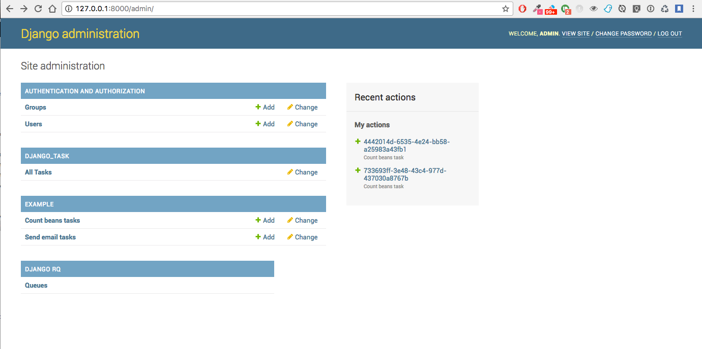
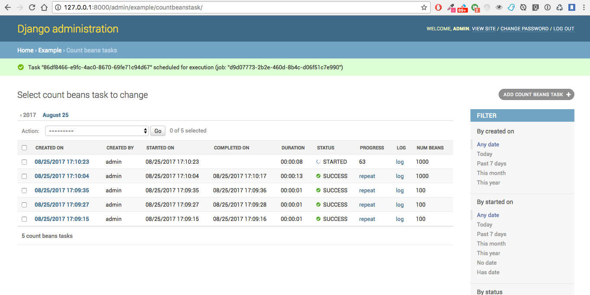

=============================
Django Task
=============================

.. image:: https://badge.fury.io/py/django-task.svg
    :target: https://badge.fury.io/py/django-task

.. image:: https://travis-ci.org/morlandi/django-task.svg?branch=master
    :target: https://travis-ci.org/morlandi/django-task

.. image:: https://codecov.io/gh/morlandi/django-task/branch/master/graph/badge.svg
    :target: https://codecov.io/gh/morlandi/django-task

A Django app to run new background tasks from either admin or cron, and inspect task history from admin

Quickstart
----------

Install Django Task::

    pip install django-task

Add it to your `INSTALLED_APPS`:

.. code-block:: python

    INSTALLED_APPS = (
        ...
        'django_rq',
        'django_task',
        ...
    )

Add Django Task's URL patterns:

.. code-block:: python

    urlpatterns = [
        ...
        url(r'^django_task/', include('django_task.urls', namespace='django_task')),
        ...
    ]

Features
--------

**Purposes**

    - create async tasks programmatically
    - create and monitor async tasks from admin
    - log all tasks in the database for later inspection

**Details**

1. each specific job is described my a Model derived from models.Task, which
   is responsible for:

    - selecting the name for the consumer queue among available queues
    - collecting and saving all parameters required by the associated job
    - running the specific job asyncronously

2. a new job can be run either:

    - creating a Task from the Django admin
    - creating a Task from code, then calling Task.run()

3. job execution workflow:

    - job execution is triggered by task.run(async)
    - job will receive the task.id, and retrieve paramerts from it (task.retrieve_params_as_dict())
    - on start, job will update task status to 'STARTED' and save job.id for reference
    - during execution, the job can update the progress indicator
    - on completion, task status is finally updated to either 'SUCCESS' or 'FAILURE'
    - See example.jobs.count_beans for an example

Support Job class
-----------------

Starting from version 0.3.0, some conveniences have been added:

- The @job decorator for job functions is no more required, as Task.run() now
  uses queue.enqueue() instead of jobfunc.delay(), and retrieves the queue
  name directly from the Task itself

- each Task can set it's own TASK_TIMEOUT value (expressed in seconds),
  that when provided overrides the default queue timeout

- a new Job class has been provided to share suggested common logic before and
  after jobfunc execution

.. code :: python

    class Job(object):

        @classmethod
        def run(job_class, task_class, task_id):
            task = None
            result = 'SUCCESS'
            failure_reason = ''

            try:

                # this raises a "Could not resolve a Redis connection" exception in sync mode
                #job = get_current_job()
                job = get_current_job(connection=redis.Redis.from_url(REDIS_URL))

                # Retrieve task obj and set as Started
                task = task_class.get_task_from_id(task_id)
                task.set_status(status='STARTED', job_id=job.get_id())

                # Execute job passing by task
                job_class.execute(job, task)

            except Exception as e:
                if task:
                    task.log(logging.ERROR, str(e))
                    task.log(logging.ERROR, traceback.format_exc())
                result = 'FAILURE'
                failure_reason = str(e)

            finally:
                if task:
                    task.set_status(status=result, failure_reason=failure_reason)

        @staticmethod
        def execute(job, task):
            pass

so you can now replace the jobfunc with a simplyfied Job-derived class;
for example:

.. code :: python

    class CountBeansJob(Job):

        @staticmethod
        def execute(job, task):
            params = task.retrieve_params_as_dict()
            num_beans = params['num_beans']
            for i in range(0, num_beans):
                time.sleep(0.01)
                task.set_progress((i + 1) * 100 / num_beans, step=10)

**Execute**

Run consumer:

.. code:: bash

    python manage.py runserver

Run worker(s):

.. code:: bash

    python manage.py rqworker low high default
    python manage.py rqworker low high default
    ...

**Sample Task**

.. code:: python

    from django.db import models
    from django.conf import settings
    from django_task.models import Task

    class SendEmailTask(Task):

        sender = models.CharField(max_length=256, null=False, blank=False)
        recipients = models.TextField(null=False, blank=False,
            help_text='put addresses in separate rows')
        subject = models.CharField(max_length=256, null=False, blank=False)
        message = models.TextField(null=False, blank=True)

        TASK_QUEUE = settings.QUEUE_LOW
        TASK_TIMEOUT = 60
        DEFAULT_VERBOSITY = 2

        @staticmethod
        def get_jobfunc():
            from .jobs import send_email
            return send_email

**Sample Job**

.. code:: python

    from __future__ import print_function
    import redis
    import logging
    import traceback
    from django.conf import settings
    from .models import SendEmailTask
    from django_task.job import Job
    from rq import get_current_job

    class SendEmailJob(Job):

        @staticmethod
        def execute(job, task):
            params = task.retrieve_params_as_dict()
            recipient_list = params['recipients'].split()
            sender = params['sender'].strip()
            subject = params['subject'].strip()
            message = params['message']
            from django.core.mail import send_mail
            send_mail(subject, message, sender, recipient_list)

    # from __future__ import print_function
    # import redis
    # import logging
    # import traceback
    # from django.conf import settings
    # from .models import SendEmailTask
    # from rq import get_current_job
    # from django_rq import job

    # @job(SendEmailTask.TASK_QUEUE)
    # def send_email(task_id):

    #     task = None
    #     result = 'SUCCESS'
    #     failure_reason = ''

    #     try:

    #         # this raises a "Could not resolve a Redis connection" exception in sync mode
    #         #job = get_current_job()
    #         job = get_current_job(connection=redis.Redis.from_url(settings.REDIS_URL))

    #         #task = SendEmailTask.objects.get(id=task_id)
    #         task = SendEmailTask.get_task_from_id(task_id)
    #         task.set_status(status='STARTED', job_id=job.get_id())

    #         params = task.retrieve_params_as_dict()

    #         recipient_list = params['recipients'].split()
    #         sender = params['sender'].strip()
    #         subject = params['subject'].strip()
    #         message = params['message']

    #         from django.core.mail import send_mail
    #         send_mail(subject, message, sender, recipient_list)

    #     except Exception as e:
    #         if task:
    #             task.log(logging.ERROR, str(e))
    #             task.log(logging.ERROR, traceback.format_exc())
    #         result = 'FAILURE'
    #         failure_reason = str(e)

    #     finally:
    #         if task:
    #             task.set_status(status=result, failure_reason=failure_reason)

**Sample management command**

.. code:: python

    from django_task.task_command import TaskCommand

    class Command(TaskCommand):

        def add_arguments(self, parser):
            super(Command, self).add_arguments(parser)
            parser.add_argument('sender')
            parser.add_argument('subject')
            parser.add_argument('message')
            parser.add_argument('-r', '--recipients', nargs='*')

        def handle(self, *args, **options):
            from tasks.models import SendEmailTask

            # transform the list of recipents into text
            # (one line for each recipient)
            options['recipients'] = '\n'.join(options['recipients']) if options['recipients'] is not None else ''

            # format multiline message
            options['message'] = options['message'].replace('\\n', '\n')

            self.run_task(SendEmailTask, **options)

**Deferred Task retrieval to avoid job vs. Task race condition**

An helper Task.get_task_from_id() classmethod is supplied to retrieve Task object
from task_id safely.

*Task queues create a new type of race condition. Why ?
Because message queues are fast !
How fast ?
Faster than databases.*

See:

https://speakerdeck.com/siloraptor/django-tasty-salad-dos-and-donts-using-celery

**Howto separate jobs for different instances on the same machine**

To sepatare jobs for different instances on the same machine (or more precisely
for the same redis connection), override queues names for each instance;

for example:

.. code:: python

    # file "settings.py"

    REDIS_URL = 'redis://localhost:6379/0'
    ...

    #
    # RQ config
    #

    RQ_PREFIX = "myproject_"
    QUEUE_DEFAULT = RQ_PREFIX + 'default'
    QUEUE_HIGH = RQ_PREFIX + 'high'
    QUEUE_LOW = RQ_PREFIX + 'low'

    RQ_QUEUES = {
        QUEUE_DEFAULT: {
            'URL': REDIS_URL,
            #'PASSWORD': 'some-password',
            'DEFAULT_TIMEOUT': 360,
        },
        QUEUE_HIGH: {
            'URL': REDIS_URL,
            'DEFAULT_TIMEOUT': 500,
        },
        QUEUE_LOW: {
            'URL': REDIS_URL,
            #'ASYNC': False,
        },
    }

    RQ_SHOW_ADMIN_LINK = False
    DJANGOTASK_LOG_ROOT = os.path.abspath(os.path.join(BASE_DIR, '..', 'protected', 'tasklog'))
    DJANGOTASK_ALWAYS_EAGER = False

then run worker as follows:

.. code:: python

    python manage.py rqworker myproject_default

**Howto schedule jobs with cron**

Call management command 'count_beans', which in turn executes the required job.

For example::

    SHELL=/bin/bash
    PATH=/usr/local/sbin:/usr/local/bin:/sbin:/bin:/usr/sbin:/usr/bin

    0 * * * *  {{username}}    timeout 55m {{django.pythonpath}}/python {{django.website_home}}/manage.py count_beans 1000 >> {{django.logto}}/cron.log 2>&1

A base class TaskCommand has been provided to simplify the creation of any specific
task-related management commad;

a derived management command is only responsible for:

- defining suitable command-line parameters
- selecting the specific Task class and job function

for example:

.. code:: python

    from django_task.task_command import TaskCommand

    class Command(TaskCommand):

        def add_arguments(self, parser):
            super(Command, self).add_arguments(parser)
            parser.add_argument('num_beans', type=int)

        def handle(self, *args, **options):
            from tasks.models import CountBeansTask
            self.run_task(CountBeansTask, **options)

Screenshots
-----------

App settings
------------

DJANGOTASK_LOG_ROOT
    Path for log files.

    Default: None

    Example: os.path.abspath(os.path.join(BASE_DIR, '..', 'protected', 'tasklog'))

DJANGOTASK_ALWAYS_EAGER

    When True, all task are execute syncronously (useful for debugging and unit testing).

    Default: False

task.log(logging.ERROR, traceback.format_exc())

REDIS_URL

    Redis server to connect to

    Default: 'redis://localhost:6379/0'

Running Tests
-------------

* TODO

Does the code actually work?

::

    source <YOURVIRTUALENV>/bin/activate
    (myenv) $ pip install tox
    (myenv) $ tox

Credits
-------

References:

- `A simple app that provides django integration for RQ (Redis Queue) <https://github.com/ui/django-rq>`_
- `Asynchronous tasks in django with django-rq <https://spapas.github.io/2015/01/27/async-tasks-with-django-rq/>`_
- `django-rq redux: advanced techniques and tools <https://spapas.github.io/2015/09/01/django-rq-redux/>`_
- `Benchmark: Shared vs. Dedicated Redis Instances <https://redislabs.com/blog/benchmark-shared-vs-dedicated-redis-instances/>`_
- `Django tasty salad - DOs and DON'Ts using Celery by Roberto Rosario <https://speakerdeck.com/siloraptor/django-tasty-salad-dos-and-donts-using-celery>`_

Tools used in rendering this package:

*  Cookiecutter_
*  `cookiecutter-djangopackage`_

.. _Cookiecutter: https://github.com/audreyr/cookiecutter
.. _`cookiecutter-djangopackage`: https://github.com/pydanny/cookiecutter-djangopackage
